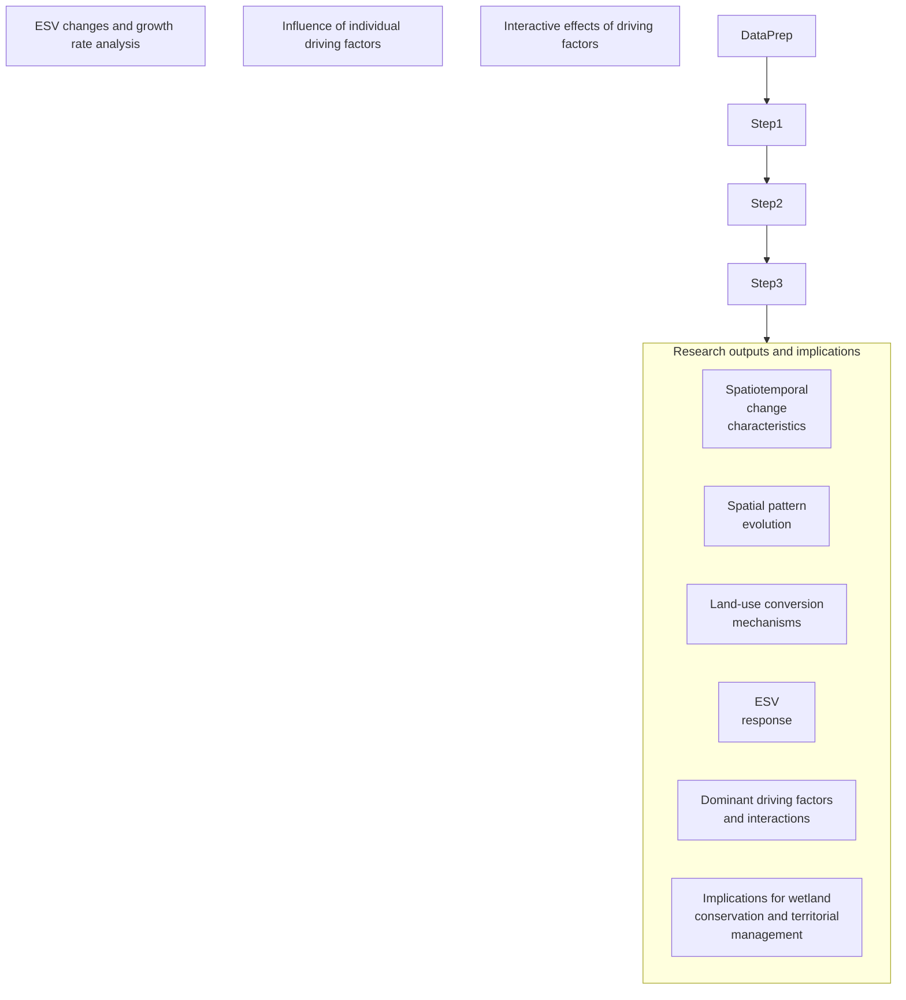

```mermaid
flowchart TD
            S3_2["ESV changes and growth rate analysis"]
            S3_3["Influence of individual driving factors"]
            S3_4["Interactive effects of driving factors"]
    class Step3 stepStyle;
    class Step3_1,Step3_2,Step3_3,Step3_4 subStepStyle;
    class S3_1,S3_2,S3_3,S3_4 itemStyle;

    %% Research Outputs Section
    subgraph Outputs ["Research outputs and implications"]
        direction LR
        O1["Spatiotemporal<br>change<br>characteristics"]
        O2["Spatial pattern<br>evolution"]
        O3["Land-use conversion<br>mechanisms"]
        O4["ESV<br>response"]
        O5["Dominant driving factors<br>and interactions"]
        O6["Implications for wetland<br>conservation and territorial<br>management"]
    end
    class Outputs outStyle;
    class O1,O2,O3,O4,O5,O6 itemStyle;

    %% Flow Connections
    DataPrep --> Step1
    Step1 --> Step2
    Step2 --> Step3
    Step3 --> Outputs
```